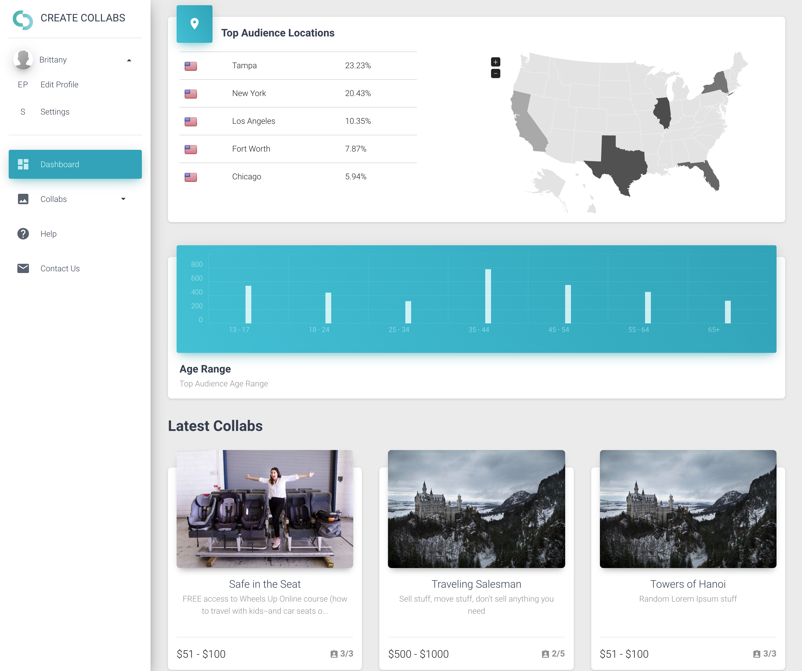

# [Create Collabs](https://www.createcollabs.com/)




Steps to run
```console
>> git clone https://github.com/finetimi/cc.git
>> cd frontend
>> git npm install
>> npm start
# visit browser on http://localhost:3000
```


## Useful Links

- [Create Collabs Homepage](https://www.createcollabs.com/)

- [Create Collabs Slack](https://createcollabs.slack.com/)

- [Material Dashboard Theme](./material-dashboard-pro-react-v1.3.0.zip) 


## File Structure

Within the project you'll find the following directories and files:

```
frontend
│
├── 
├── README.md
├── documentation
│   ├── assets
│   │   ├── css
│   │   ├── img
│   │   │   └── faces
│   │   └── js
│   └── tutorial-components.html
├── package.json
├── public
│   ├── favicon.ico
│   ├── index.html
│   └── manifest.json
└── src
    |
    └── views
    |    ├── Collabs
    |    |   └── WizardSteps
    |    |   |     └── Step1.jsx
    |    |   |     └── Step2.jsx 
    |    |   |     └── Step3.jsx 
    |    |   |
    |    |   └── ActiveCollabs.jsx
    |    |   └── AllCollabs.jsx
    |    |   └── CollabDetails.jsx
    |    |   └── CollabsTable.jsx
    |    |   └── CollabWizard.jsx
    |    |   └── NewCollab.jsx
    |    |
    |    ├── ContactUs
    |    │   └── ContactUs.jsx
    |    |
    |    ├── Dashboard
    |    │   └── Dashboard.jsx
    |    |
    |    ├── EditProfile
    |    │   └── EditProfile.jsx
    |    |
    |    └── Help
    |        └── Help.jsx
    ├── assets
    │   ├── img
    │   │   ├── faces
    │   │   ├── flags
    │   │   └── logo-white.svg
    │   ├── jss
    │   │   ├── material-dashboard-pro-react
    │   │   │   ├── components
    │   │   │   ├── layouts
    │   │   │   └── views
    │   │   └── material-dashboard-pro-react.jsx
    │   └── scss
    │       ├── material-dashboard-pro-react
    │       │   ├── mixins
    │       │   └── plugins
    │       └── material-dashboard-pro-react.scss
    ├── components
    │   ├── Accordion
    │   │   └── Accordion.jsx
    │   ├── Badge
    │   │   └── Badge.jsx
    │   ├── Card
    │   │   ├── Card.jsx
    │   │   ├── CardAvatar.jsx
    │   │   ├── CardBody.jsx
    │   │   ├── CardFooter.jsx
    │   │   ├── CardHeader.jsx
    │   │   ├── CardIcon.jsx
    │   │   └── CardText.jsx
    │   ├── Clearfix
    │   │   └── Clearfix.jsx
    │   ├── CustomButtons
    │   │   └── Button.jsx
    │   ├── CustomDropdown
    │   │   └── CustomDropdown.jsx
    │   ├── CustomInput
    │   │   └── CustomInput.jsx
    │   ├── CustomLinearProgress
    │   │   └── CustomLinearProgress.jsx
    │   ├── CustomTabs
    │   │   └── CustomTabs.jsx
    │   ├── CustomUpload
    │   │   ├── ImageUpload.jsx
    │   │   └── PictureUpload.jsx
    │   ├── Footer
    │   │   └── Footer.jsx
    │   ├── Grid
    │   │   ├── GridContainer.jsx
    │   │   └── GridItem.jsx
    │   ├── Header
    │   │   ├── Header.jsx
    │   │   ├── HeaderLinks.jsx
    │   │   └── PagesHeader.jsx
    │   ├── Heading
    │   │   └── Heading.jsx
    │   ├── InfoArea
    │   │   └── InfoArea.jsx
    │   ├── Instruction
    │   │   └── Instruction.jsx
    │   ├── NavPills
    │   │   └── NavPills.jsx
    │   ├── Pagination
    │   │   └── Pagination.jsx
    │   ├── Sidebar
    │   │   └── Sidebar.jsx
    │   ├── Snackbar
    │   │   ├── Snackbar.jsx
    │   │   └── SnackbarContent.jsx
    │   ├── Table
    │   │   └── Table.jsx
    │   ├── Tasks
    │   │   └── Tasks.jsx
    │   ├── Timeline
    │   │   └── Timeline.jsx
    │   ├── Typography
    │   │   ├── Danger.jsx
    │   │   ├── Info.jsx
    │   │   ├── Muted.jsx
    │   │   ├── Primary.jsx
    │   │   ├── Quote.jsx
    │   │   ├── Success.jsx
    │   │   └── Warning.jsx
    │   └── Wizard
    │       └── Wizard.jsx
    ├── index.js
    ├── layouts
    │   ├── Dashboard.jsx
    │   ├── Pages.jsx
    │   └── RTL.jsx
    ├── routes
    │   ├── dashboard.jsx
    │   ├── index.jsx
    │   ├── pages.jsx
    │   └── rtl.jsx
    ├── variables
    │   ├── charts.jsx
    │   └── general.jsx
    |____..
```
